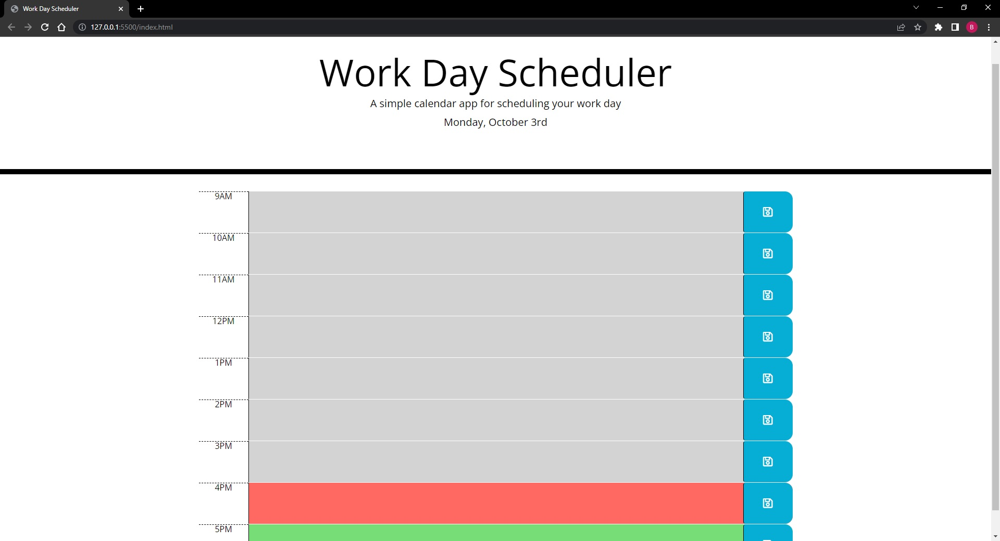

# Work-Day-Scheduler

## Overview
This project was created to showcase jQuery along with moment Momentjs. These both are extremely powerful JavaScript 
libraries that can make code much much shorter than if done with traditional JavaScript methods. Both of these
libraries are very useful and helped make JavaScript easier to use and allows for code to be shortened.
## Link to live Webpage
https://frutaseca.github.io/Work-Day-Scheduler/ 
## Screenshot of Webpage
